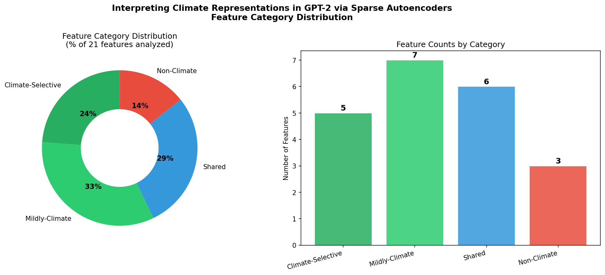
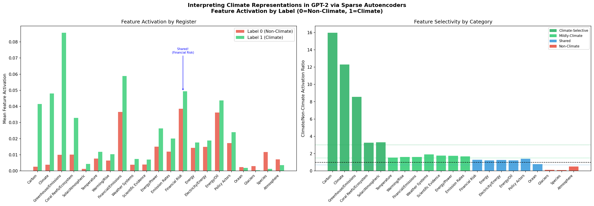
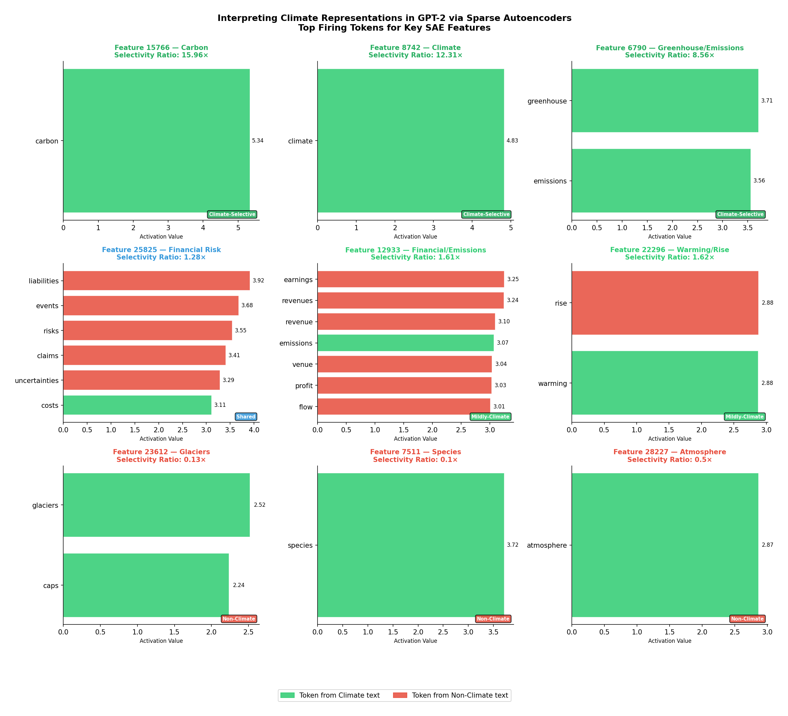

# Interpreting Climate Representations in GPT-2 via Sparse Autoencoders

[](https://python.org)
[](https://pytorch.org)
[](https://opensource.org/licenses/MIT)

A mechanistic interpretability project that applies **Sparse Autoencoders (SAEs)** to GPT-2 Medium to discover and interpret how climate-related concepts are internally represented inside the model.

This project replicates and extends the approach from Anthropic's [Towards Monosemanticity](https://transformer-circuits.pub/2023/monosemantic-features) paper to the climate change domain using the [ClimateEval](https://huggingface.co/datasets/murathankurfali/ClimateEval) dataset. It also extends prior work on financial sentiment feature extraction to a new domain.

---

## Overview

```
ClimateEval Dataset (30K sentences, 839,773 tokens)
              ↓
GPT-2 Medium — Layer 17 MLP post-GELU hook (4,096 dims)
              ↓
Sparse Autoencoder (32,768 features, 8× expansion)
              ↓
Feature Discovery + Register Selectivity Analysis
              ↓
21 Climate Features across 4 Categories
```

---

## Key Findings

| Category | Count | Example Features |
|----------|-------|-----------------|
| Climate-Selective | 5 | Carbon (15.96×), Climate (12.31×), Greenhouse/Emissions (8.56×) |
| Mildly-Climate | 7 | Warming/Rise (1.62×), Weather Systems (1.90×) |
| Shared | 6 | Financial Risk (1.28×), Energy (1.23×) |
| Non-Climate | 3 | Glaciers (0.13×), Species (0.10×), Atmosphere (0.50×) |

**Most surprising finding:** Tokens like "glaciers", "species", and "atmosphere" — intuitively climate-related — are encoded by GPT-2 primarily in geological, biological, and general scientific contexts rather than climate discourse. This demonstrates that token-level inspection alone is insufficient for feature interpretation.

---

## Results

### Feature Category Distribution


### Feature Activation by Label and Selectivity Ratio


### Top Firing Tokens for Key SAE Features


---

## Project Structure

```
climate-sae-gpt2/
├── figures/
│   ├── category_distribution.png       # Donut + bar chart of feature categories
│   ├── feature_analysis_4cat.png       # Activation by label + selectivity ratios
│   └── top_tokens_highlight_9.png      # Top firing tokens for 9 key features
├── README.md
├── climate_activations_interpret_via_SAE.ipynb   # Full pipeline notebook
└── requirements.txt
```

---

## Pipeline

The notebook is organized into four sections:

| Section | Description |
|---------|-------------|
| 1. Model Setup & Activation Collection | Load GPT-2 Medium, hook layer 17 mlp.act, collect 839,773 token activations |
| 2. SAE Training | Train 32,768-feature SAE with L1=0.4 for 10 epochs |
| 3. Feature Discovery | Keyword search across top 500 features, discover 36 climate features |
| 4. Analysis & Visualization | Selectivity ratios, 4-category classification, all figures |

---

## Setup

### Requirements

```bash
pip install -r requirements.txt
```

### Run on Google Colab (Recommended)

This project was developed on **Google Colab Pro with NVIDIA A100 80GB GPU**.

1. Upload the notebook to Google Colab
2. Mount Google Drive for saving activations and SAE weights
3. Run all sections in order

### Run Locally

```bash
git clone https://github.com/yourusername/climate-sae-gpt2.git
cd climate-sae-gpt2
pip install -r requirements.txt
jupyter notebook climate_activations_interpret_via_SAE.ipynb
```

---

## Configuration

```python
MODEL_NAME    = "gpt2-medium"   # 354M parameters, 24 layers
TARGET_LAYER  = 17              # Hook point: upper-middle semantic layer
HOOK_POINT    = "mlp.act"       # Post-GELU, 4096 dims

MAX_SENTENCES = 30_000          # Subset of ClimateEval train split
INPUT_DIM     = 4096            # Activation dimension
DICT_SIZE     = 32768           # 8x expansion
L1_COEFF      = 0.4             # Sparsity penalty
LR            = 1e-4            # Adam learning rate
EPOCHS        = 10              # Training epochs
BATCH_SIZE    = 2048            # Tokens per batch
```

---

## SAE Training Results

| Epoch | Total Loss | Recon Loss | Avg Active Features |
|-------|-----------|------------|---------------------|
| 1 | 115.30 | 101.46 | 287.4 |
| 5 | 64.87 | 49.03 | 230.1 |
| 10 | 60.54 | 44.75 | 230.0 ✅ |

**Final sparsity:** 231 active features per token out of 32,768 (0.7%)

---

## Important Note on Feature Indices

> ⚠️ SAE feature indices are **not deterministic** across training runs. If you retrain the SAE, feature indices will change and the keyword discovery step must be rerun. The hardcoded indices in the notebook are specific to this training run. Use the dynamic keyword search cell to rediscover features for your own trained model.

---

## Related Work

- [Towards Monosemanticity — Anthropic (2023)](https://transformer-circuits.pub/2023/monosemantic-features)
- [Toy Models of Superposition — Elhage et al. (2022)](https://transformer-circuits.pub/2022/toy_model/index.html)
- [ClimateEval Dataset — Kurfali (2023)](https://huggingface.co/datasets/murathankurfali/ClimateEval)

---

## Citation

```bibtex
@misc{climate-sae-gpt2-2026,
  title   = {Interpreting Climate Representations in GPT-2 via Sparse Autoencoders},
  author  = {Diksha Phuloria},
  year    = {2026},
  url     = {https://github.com/dikshaphuloria/climate-sae-gpt2.git}
}
```

---

## License

MIT License — feel free to use, modify and build on this work.